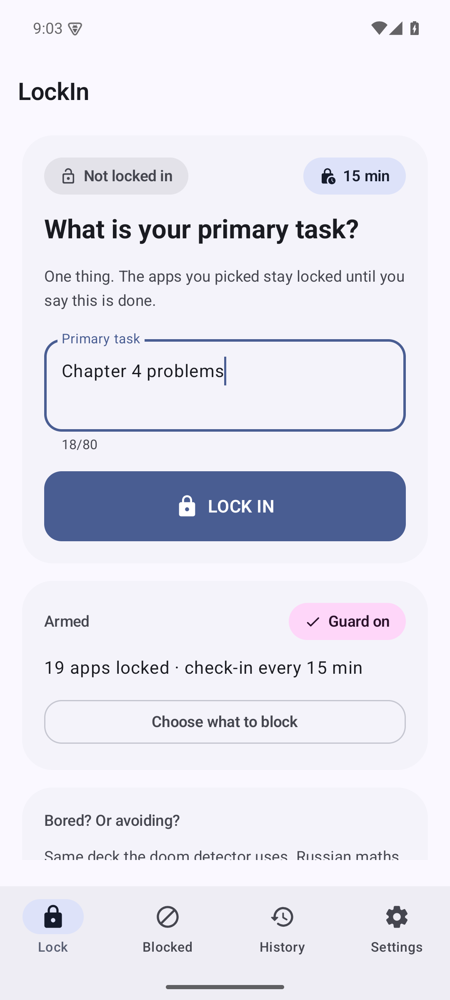
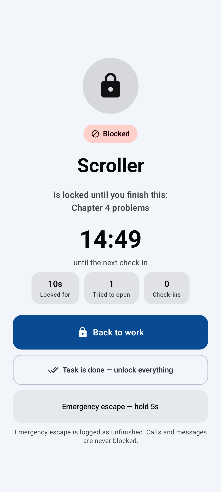
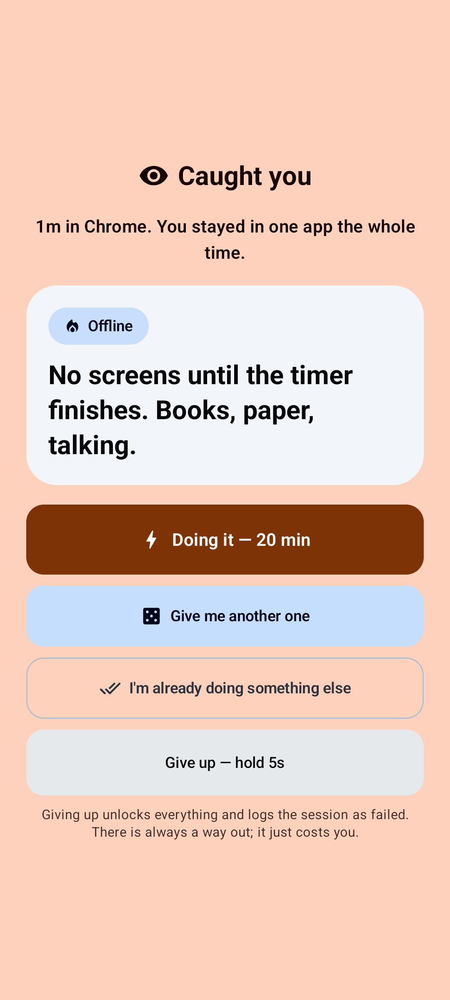
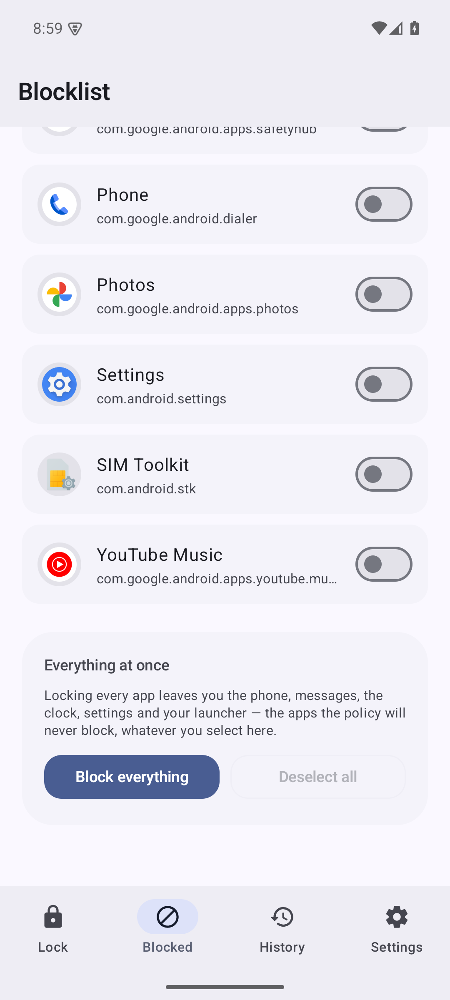
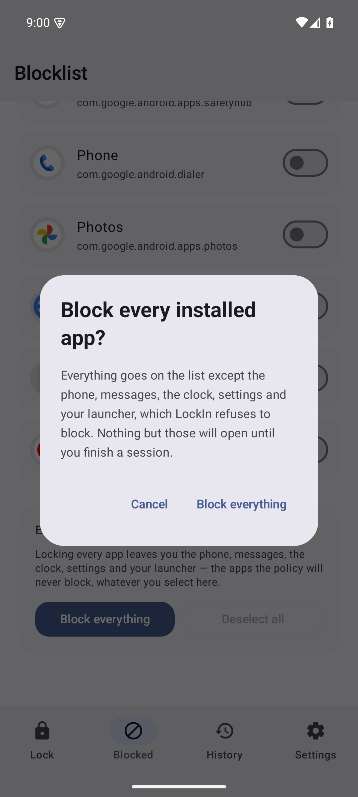
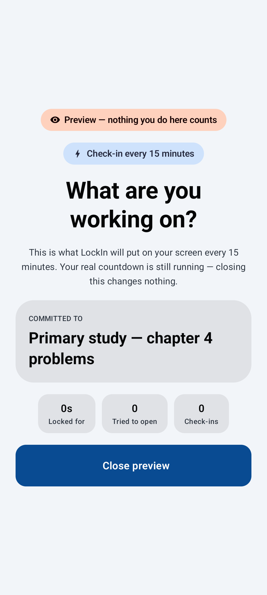
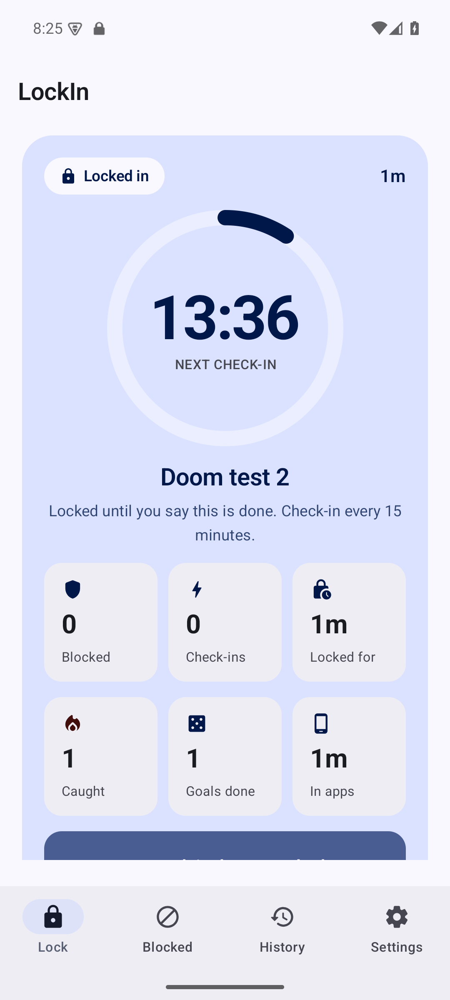
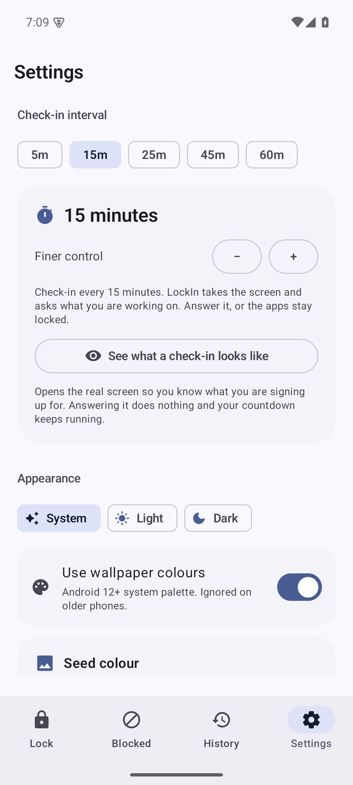

# LockIn

**An Android app blocker that will not let you off the hook.**

Name one task. Pick the apps you keep opening instead of doing it. LockIn slams a
full-screen wall over those apps, and every 15 minutes it takes the whole screen
and asks what you are working on. The apps stay locked until **you** say the task
is done — not until a timer runs out, not with a snooze button. Swipe the check-in
away and it comes straight back, and it keeps count of how many times you dodged.

It also notices when you are not working. Fifteen minutes inside a blocked app
raises a wall of its own and hands you something to do instead.

<p align="center">
  
  
  
</p>

---

## Contents

- [What it actually does](#what-it-actually-does)
- [The doom detector](#the-doom-detector)
- [Install](#install)
- [First run](#first-run)
- [How the blocking works, and why](#how-the-blocking-works-and-why)
- [Architecture](#architecture)
- [Design](#design)
- [Build](#build)
- [Testing](#testing)
- [Permissions](#permissions)
- [Known limits](#known-limits)
- [Contributing](#contributing)

---

## What it actually does

| | |
|---|---|
| **The wall** | Open a blocked app and a full-screen takeover appears over it. Back, home and recents all route back to something you are allowed to use — never to the app you were reaching for. |
| **The check-in** | Every *N* minutes (15 by default) the screen is taken over with one question: *what are you working on?* No dismiss gesture, no timeout. |
| **The commitment** | The apps stay locked until you press **Task is done**. There is no session length and no grace period; the task decides how long it takes. |
| **The escape** | A five-second press-and-hold unlocks you and logs the session as `ESCAPED`. It is a door you have to mean opening, and it is on your record. |
| **The rebound** | Rebooting, updating the app, or the process being killed under memory pressure does not dissolve a session. A check-in that came due while the guard was off is still owed. |
| **The doom detector** | Fifteen minutes inside a blocked app — or inside a known time sink you deliberately left unblocked — raises its own wall and hands you a task. |
| **The exceptions** | Phone, dialer, in-call UI, messages, clock, settings, package installer and your launcher can never be blocked. A focus timer must not be the reason you cannot answer the phone. |

<p align="center">
  
  
</p>

**Block everything** puts every installed app on the list in one tap. What is
left is the phone, messages, the clock, settings and your launcher — the apps
`AccessPolicy` refuses to block whatever you select, because bricking a phone is
worse than any distraction.

### Seeing it before you commit to it

Waiting fifteen minutes to find out what a check-in looks like is a bad way to
learn whether you want one. Settings → Check-in interval → **"See what a check-in
looks like"** opens the real takeover immediately, badged *Preview*.

The preview is a look, not a door: it records no answer, counts no dodge, and
leaves your real countdown running. Only a single **Close preview** button is
offered.

<p align="center">
  
</p>

For a fast end-to-end test of enforcement, drop the interval to one minute with the
**−** stepper (it goes down to 1) and lock in. You will see the screen in about
sixty seconds.

---

## The doom detector

The check-in asks whether you are working. It does not notice that you are *not*.
Fifteen minutes in a row inside a blocked app, or fifteen minutes of blocked apps
in total, raises a different screen:

> **Caught you** — 15m in TikTok. You stayed in one app the whole time.
> **Russian** — *Russian maths — 20 minutes of sums, no phone*
> **Doing it — 20 min**

There is no *Back to work* on that screen, because that is the button that would
put you straight back into the feed. The ways out are doing the thing on screen,
taking a different thing off the same 34-card deck, saying you are already busy,
or the five-second hold, which ends the session as `ESCAPED`.

**Two rules, because they are different behaviours and neither catches the other:**

- **Continuous** — parked in one app, not leaving. The classic doom scroll.
- **Cumulative** — the time in total across all of them, so hopping between
  TikTok and Instagram every ninety seconds does not slip through. The cumulative
  rule additionally needs a minute of unbroken attention, so dipping in and out
  all evening is not doom scrolling and is not treated as it.

**It also watches apps you did not block.** Blocking TikTok is easy; the harder
case is leaving it off the list because you need it for something and falling into
it anyway. So any installed app on the known-distractor list counts towards the
fifteen minutes whether or not it is blocked. The goal screen *is* the block:
fifteen minutes in, you are out until you have done the thing.

Driving it is window changes, not scroll events. That keeps
`canRetrieveWindowContent="false"` honest — the app still cannot see your screen —
and *"did not leave this app for fifteen minutes"* is a fact about you rather than
an accident of how somebody else's app happens to be built.

Settings → **Doom detector** turns it off or moves the line (1 to 120 minutes).
The home screen also carries a **Give me something to do** button that rolls the
same deck deliberately, for when you are merely bored rather than caught.

<p align="center">
  
  
</p>

---

## Install

**Download a release** from the Releases tab, or build it yourself:

```bash
git clone https://github.com/loak7993-code/lockin.git
cd lockin
./gradlew :app:assembleDebug
adb install -r app/build/outputs/apk/debug/app-debug.apk
```

`local.properties` must point at an SDK with platform 37 and build-tools 37.0.0:

```properties
sdk.dir=/path/to/Android/sdk
```

| | |
|---|---|
| Minimum device | **Android 10 (API 29)** |
| Built and tested against | API 35 and 37 |
| Language | Kotlin 2.4, Jetpack Compose, Material 3 |
| Gradle / AGP | 9.8 / 9.4.1, JDK 17 |

### Release signing

`assembleRelease` is signed with the debug key so it produces an installable
artifact straight out of the build. **Replace it before you distribute anything:**

```kotlin
// app/build.gradle.kts
signingConfigs {
    create("upload") {
        storeFile = file(System.getenv("LOCKIN_KEYSTORE"))
        storePassword = System.getenv("LOCKIN_STORE_PASSWORD")
        keyAlias = System.getenv("LOCKIN_KEY_ALIAS")
        keyPassword = System.getenv("LOCKIN_KEY_PASSWORD")
    }
}
// and in buildTypes.release: signingConfig = signingConfigs.getByName("upload")
```

---

## First run

1. **Turn on the focus guard** — Settings → Accessibility → Installed services →
   *LockIn focus guard*. This is the only permission that matters. Without it the
   LOCK IN button stays disabled, because the app could not see which app is
   opening and therefore could not block anything.
2. **Allow notifications** — the countdown lives there, and a check-in can arrive
   as a full-screen notification if the system ever blocks the overlay path.
3. **Name your task and pick your apps.** Done.

---

## How the blocking works, and why

Android has no supported way for an ordinary app to block another app. Device
admin app limits are deprecated and Play-restricted; `SYSTEM_ALERT_WINDOW` cannot
stop an app from launching, only cover it, and it is a much scarier permission to
ask for.

LockIn uses an **AccessibilityService** that declares:

```xml
android:accessibilityEventTypes="typeWindowStateChanged"
android:canRetrieveWindowContent="false"
android:accessibilityFlags="flagDefault"
```

It reads exactly one thing: the package name of the window that came to the front.
It cannot see screen content, cannot type, cannot scroll, and has no network
permission at all. An accessibility service is also the only ordinary component
Android lets start an activity while something else is in the foreground, which is
precisely what a 15-minute "what are you working on" takeover needs.

There is a second path that does not depend on it: a high-importance
full-screen-intent notification on a separate channel, used when the guard is off
or the system refuses the overlay path.

### Three clocks, so a dead process cannot silently disarm the timer

1. The foreground service ticks every 250ms. Happy path.
2. The accessibility service also ticks on every window change. The system keeps
   accessibility services alive far more reliably than plain services.
3. A system-held `setExactAndAllowWhileIdle` alarm, armed for the exact minute the
   check-in is due. If the battery manager kills the service *and* the user hasn't
   touched the screen, the alarm still wakes the app and the check-in still lands.

A focus timer that quietly stops counting down is worse than no focus timer — the
user would walk away believing their apps were still locked. Hence three.

The alarm is armed from `Application.onCreate`, **not** from the guard service.
That distinction was found the hard way: with the arming call in the service, a
service that died took the alarm with it and the countdown ran down to 0:00 with
nothing left to fire it.

The same reasoning now applies to the service itself. The app-scope state
collector re-`startForegroundService`s it whenever it sees an active session,
because a process killed under memory pressure used to come back with the
countdown alarm armed, the session intact, the blocklist intact — and nothing
driving any of it.

### Why an AccessibilityService is a fair trade

| It can | It cannot |
|---|---|
| See which package opened | See what is on screen (`canRetrieveWindowContent=false`) |
| Put a full-screen screen in front | Tap, scroll, or act on any app |
| Keep a countdown running | Read your notifications, contacts or files |
| | Reach the network — the app declares no `INTERNET` permission |

Everything is stored on-device. Cloud backup and device transfer are switched off
in `data_extraction_rules.xml`, so a blocklist and a focus history cannot be
copied off the phone.

---

## Architecture

```
core/            pure Kotlin, zero Android imports — this is the part with tests
  SessionEngine    the rulebook: start / tick / check-in / done / escape
  AccessPolicy     block or allow, over package-name strings only
  DoomDetector     dwell and cumulative doom rules
  GoalDeck         the 34 replacement tasks
  Clock            injected, so the engine is tested without sleeping
data/
  SettingsStore    DataStore Preferences behind typed flows
  AppCatalog       installed apps + the well-known time sinks
service/
  AppWatchService        the AccessibilityService; implements OverlayHost
  FocusGuardService      foreground service; owns the countdown and the notification
  CheckpointAlarm        the exact-alarm safety net
  BootReceiver           re-arms a session after reboot or app update
ui/
  theme/          OKLCH tonal palette generator, M3 type and shape scales
  components/     countdown ring, hold-to-escape, week bars, app rows
  screens/        home, blocklist, history, settings, onboarding
  BlockActivity       the wall
  CheckpointActivity  the 15-minute question
  GoalActivity        the doom detector's screen
LockInApp.kt      the object graph (one process, one state machine)
```

`LockIn` is a hand-rolled object graph rather than a DI framework: the app has one
process, one scope and one state machine, and a framework would be more moving
parts than the app.

### The session state machine

```
        start(task)
IDLE ──────────────► FOCUSED ──── tick() at the interval ────► CHECKPOINT
  ▲                    │  ▲                                          │
  │                    │  └──────────── acknowledge() ───────────────┤
  │                    │                                             │
  │                    └────────── retask() keeps the session ───────┤
  │                                                                   │
  └───────────────── complete() / escape() ◄──────────────────────────┘
```

There is no transition out of `FOCUSED` except an explicit user action. That is
the whole point: a lock-in ends when the task ends, not when a number runs out.

The doom detector is deliberately *not* a state in this machine. It is a side
channel that measures dwell and, on a threshold crossing, raises a screen and
records a count. Folding it into the session states would have meant a "caught"
phase that the user could be talked out of, and the whole design is that they
cannot.

---

## Design

Material 3 with generated tonal palettes rather than hand-picked hex values.
`TonalPalette` builds the scheme in **OKLCH** from a single seed colour, walking
chroma down when a request falls outside the sRGB gamut instead of clipping
channels (which would rotate the hue of every saturated role). Consequences:

- every role at the same tone has the same perceived lightness, so the scheme is
  legible in light and dark without anyone eyeballing forty colours;
- contrast is a property of the algorithm, not of a reviewer's eye — the palette
  tests assert WCAG AA for eight seeds in both schemes;
- dynamic colour is used when Android offers it, four built-in seeds are there
  when it does not, and any photo can be dropped in to have its dominant colour
  extracted as a seed.

Screens cap their measure at 720dp and centre on anything wider, because a
full-screen takeover on a tablet is otherwise a 400-character line.

---

## Build

```bash
./gradlew build              # assemble, lint, unit tests
./gradlew :app:assembleDebug # installable debug APK
./gradlew :app:assembleRelease
```

`build` runs lint with `warningsAsErrors = true` and `abortOnError = true`, so a
new warning fails the build rather than scrolling past. There is exactly one
suppression, in `app/lint.xml`, for `mipmap-anydpi-v26` (adaptive icons with no
raster fallback); it was checked against `aapt2` rather than added on faith.

Release builds are minified and resource-shrunk (R8 + `shrinkResources`).
Serialization metadata is kept explicitly in `proguard-rules.pro` — R8 will
happily strip a `@Serializable` class and leave you with a runtime crash on the
first DataStore read.

---

## Testing

**64 JVM unit tests. No instrumentation required, no device needed to run them.**

| Suite | Covers |
|---|---|
| `SessionEngineTest` | Blank tasks, double-locking, exactly-once check-in firing, the countdown not resetting on a repeated `tick()`, nag counting, both session outcomes, restoring a session that was already overdue, interval clamping |
| `AccessPolicyTest` | Self, launcher, dialer, in-call UI, system UI, settings, package installer and messages can never be blocked; an explicit always-allowed entry beats the blocklist |
| `DoomDetectorTest` | 15 minutes in one app trips and 14 does not; hopping between four apps trips the cumulative rule while ten-second dips do not; time is banked when an app is left rather than lost; one fire and not one per tick; answering a goal rebases the clock so you are not re-caught instantly, but a *fresh* 15 minutes still trips; the reported session total is never refunded by a goal; moving the threshold refunds nothing either; a backwards clock cannot manufacture doom |
| `GoalDeckTest` | Every category populated and self-consistent, rerolling never returns the same goal, draws are reproducible from a seed, and no goal can require the internet, money or an account |
| `TonalPaletteTest` | WCAG AA contrast for eight seeds in light and dark, monotonic container tones, determinism, and the sRGB gamma curve |
| `LockInStreakTest` | Streak counting across day boundaries, escapes, gaps and a day that has not been logged yet |

### Verified on a real device

The enforcement itself was driven end to end on an API 35 emulator against a
separate fixture app (a stand-in short-video feed), not merely unit tested:

| Behaviour | Result |
|---|---|
| Open a blocked app while locked in | `BlockActivity` takes over within ~1s |
| *Back to work* | Returns to the **previous** app, not the blocked one |
| Back / home / recents on the block screen | Always route somewhere allowed |
| Check-in at the interval | Fired unprompted at **15:00** on a real 15-minute session (started 06:51:36, screen raised 07:06:43) |
| Alarm fires with the app backgrounded | Exactly one fire at 60s on a 1-minute interval, screen raised over the launcher |
| Back on the check-in | Screen stays; counter reads *"Twice now. Still here."* |
| Home, then any app | Check-in re-asserts immediately |
| *Still on it* | Countdown restarts, blocklist stays on |
| *It's done* | Apps freed, session logged `DONE` with duration, blocks and check-ins |
| 5-second hold on *Emergency escape* | Session ended, logged `ESCAPED` |
| Guard switched off | LOCK IN disabled, both warnings shown, nothing blocked |
| Release (R8-minified) build | Settings, blocklist and blocking all still work |

The doom detector was verified the same way, with the threshold at 1 minute and
Chrome as a *watched but unblocked* distractor:

| Behaviour | Result |
|---|---|
| Sit in Chrome past the threshold | `GoalActivity` raised unprompted — `Doom detector tripped: CONTINUOUS in Chrome after 63s` |
| The goal screen | Names the app, the time, the trigger, and a categorised task |
| *Give me another one* | Draws a different goal from the deck |
| *Doing it* | Starts a committed countdown; the clock cannot be restarted or rerolled once running |
| *I'm already doing something else* | Dismisses, credits the goal, blocking resumes |
| Answering, then going straight back | A full fresh minute is required before it fires again |
| A check-in coming due mid-goal | The goal wins; the check-in is still owed and fires once the goal is answered |
| Process killed while locked in | The guard service comes back on its own and the session keeps enforcing |
| Block everything / Deselect all | Both present, with a confirmation for the destructive one |

Four bugs were found and fixed by that testing, all of which had been invisible
to the unit tests:

- the guard service never came back after process death, leaving a live session
  with nothing driving it;
- the doom detector ignored the stored threshold until the setting was changed
  again;
- `rearm()` zeroed the running total, so the "time in apps" statistic froze at
  whatever it happened to be when you were first caught;
- changing the threshold built a fresh detector that discarded accumulated dwell,
  handing back time already served.

All four now have regression tests.

Screens were checked in portrait, landscape and at a 480dp compact width, in
light and dark, with dynamic colour on and with three generated seeds.

**Not verified on device:** the literal `BOOT_COMPLETED` branch. The emulator's
SystemUI ANR'd across the reboot and never recovered. The *identical* code path
was verified through `MY_PACKAGE_REPLACED`, which shares the receiver, the
`restoreSession` call and the DataStore read:

```
I LockIn: Resumed session 'Primary study -- chapter 4 problems'
          after android.intent.action.MY_PACKAGE_REPLACED
```

The two actions differ only in the string in the receiver's `when` guard. This is
the one claim in this file not backed by a device observation, and it is called
out here rather than papered over.

---

## Permissions

| Permission | Why |
|---|---|
| `BIND_ACCESSIBILITY_SERVICE` | See which app opens, so it can be blocked. Declared as a service permission; you grant it in Settings. |
| `FOREGROUND_SERVICE`, `FOREGROUND_SERVICE_SPECIAL_USE` | The countdown must survive the app being backgrounded. |
| `POST_NOTIFICATIONS` | Countdown + check-in notification. |
| `USE_FULL_SCREEN_INTENT` | Backup path for the check-in when the overlay is refused. |
| `RECEIVE_BOOT_COMPLETED` | A session survives a reboot. |
| `SCHEDULE_EXACT_ALARM` | The check-in alarm fires to the minute. Without it the alarm falls back to an inexact window — late by minutes, not never. |
| `VIBRATE` | The check-in is felt, not just seen. |

There is **no `INTERNET` permission**. The app cannot phone home because it has
no way to.

---

## Known limits

- **Uninstalling LockIn ends the session.** There is no way to defend against that;
  the escape hatch is deliberately visible and the cost of using it is on your
  record, but a determined user with the app drawer open can always remove it.
- **Disabling the focus guard mid-session stops enforcement.** The guard cannot
  police itself. The block screen detects this and closes rather than pretending.
- **Split screen and some OEM "focus modes" can suppress activity launches.**
  Three redundant paths reduce the exposure; none eliminate it.
- **OEM battery management is the most likely real-device failure.** Xiaomi, Oppo
  and Vivo in particular will kill a foreground service for a "short-video" app
  that has no Play-distribution history. If the countdown freezes, that is the
  cause, and the notification is where to look first.
- **The doom detector cannot tell scrolling from a long video.** It measures
  dwell. Someone watching a 20-minute YouTube lecture trips it exactly like
  someone doom-scrolling. That is the intended trade — remove the app from the
  known-distractor list in `AppCatalog.kt` if it bothers you.
- **`BOOT_COMPLETED` resume is unverified on device** — see [Testing](#testing).
  The shared code path is verified via app update.
- **Screen readers** get the hold-to-escape button through a long-click action,
  but a five-second hold is inherently a poor fit for switch access. It is
  reachable, not comfortable.

---

## Contributing

Issues and pull requests are welcome. If you are adding behaviour:

- keep `core/` free of Android imports — that boundary is what makes the rulebook
  testable in milliseconds;
- add a unit test for anything that changes a rule, not just a screen;
- `./gradlew build` must pass with zero warnings. It is not a formality; the lint
  config is `warningsAsErrors`.

---

## License

MIT. See [LICENSE](LICENSE).

Built because every app blocker I could find either had a snooze button, counted
down instead of asking, or gave up the moment the process was killed.
